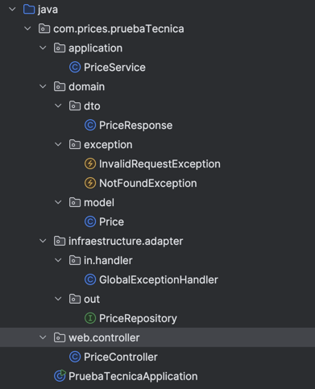
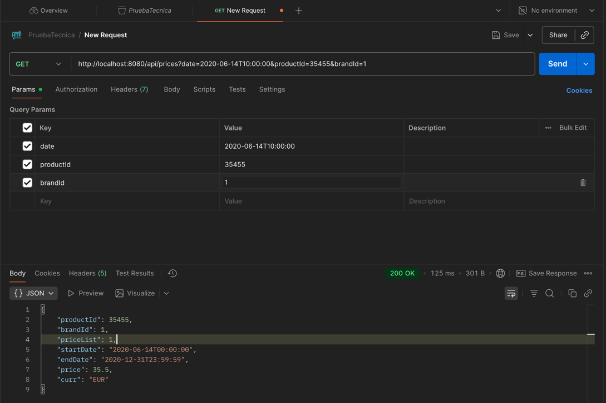
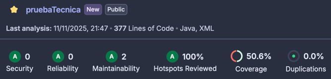

# **PRUEBA TÉCNICA - API DE PRECIOS**
## **DESCRIPCIÓN**
Este proyecto implementa una API REST que devuelve el precio aplicable de un producto en función de tres parámetros:

    Fecha de aplicación
    ID del producto
    ID de la cadena (brand)

El servicio calcula el precio correcto teniendo en cuenta la prioridad de las tarifas y el rango de fechas en el que cada una está activa.
Está desarrollado con Spring Boot 3, Java 17 y utiliza una base de datos H2 en memoria para simplificar la ejecución y las pruebas.

El proyecto sigue una arquitectura hexagonal y aplica buenas prácticas REST, además de incluir tests automatizados con JUnit para asegurar su correcto funcionamiento.

## **ARQUITECTURA DEL PROYECTO**
El proyecto tiene una arquitectura hexagonal, lo que garantiza una separación obvia
entre el dominio, la lógica y la infraestructura.

Esto facilita tanto el mantenimiento como la ampliación del sistema a futuro.

## **EJECUCIÓN DEL PROYECTO**
### Requisitos previos
    Java 17+
    Maven 3.8+
    Puerto 8080 dispoinble.

### Pruebas

Para poder realizar una prueba real se debe levantar el proyecto springboot, 
una vez lo tengamos levantado, desde postman se hará la llamada a nuestro endpoint.

## **BASE DE DATOS H2**
### Datos de conexión 
    JDBC URL:jdbc:h2:mem:pricesdb
    Usuario: sa
    Contraseña: (vacía)

### Archivos SQL
    schemaZara.sql: crea la tabla PRICES.
    dataZara.sql: inserta las tarifas base del ejercicio.

## **ENDPOINT**

    GET api/prices -> Obtiene el precio aplicable según los parámetros de entrada.

### Ejemplo de petición 

    GET http://localhost:8080/api/prices?date=2020-06-14T10:00:00&productId=35455&brandId=1

#### Respuesta OK

    {
        "productId": 35455,
        "brandId": 1,
        "priceList": 2,
        "startDate": "2020-06-14T15:00:00",
        "endDate": "2020-06-14T18:30:00",
        "price": 25.45,
        "curr": "EUR"
    }

#### Respuesta 404 Not Found

    {
        "timestamp": "2025-11-10T21:14:09.786",
        "status": 404,
        "error": "Price Not Found",
        "message": "No se encontró precio para el producto 99999, cadena 1 en la fecha 2020-06-14T10:00:00"
    }

## **TEST (JUnit 5)**

### TECNOLOGÍA UTILIZADA
    JUnit 5

### UBICACIÓN

Todos los tests se encuentran en el directorio estándar

    src/test/java/com/prices/pruebaTecnica/

Dentro de la clase

    PriceServiceTest.java

### FUNCIONAMIENTO
    Cada método está anotado con @Test
    @BeforeEach carga una lista de precios simulados antes de cada test.
    El servicio PriceService selecciona el precio correcto en función de la fecha, producto y marca.
    Las aserciones (assertEquals, assertThrows) confirman el resultado esperado.
    Las pruebas son independientes, deterministas y rápidas, perfectas para validar la lógica principal del dominio.

## **ANÁLISIS DE CALIDAD CON SONARCLOUD**

El proyecto integra SonarCloud como herramienta de análisis estático de código y control de calidad continua.

### EJECUCIÓN DEL ANÁLISIS

Lanzar análisis desde terminal.

    mvn clean verify sonar:sonar -Dsonar.token=5bd454bce2b034f2d6fd5aa796687f7e3b59687d

### RESULTADOS

    Coverage: 50% - Nivel: Media
    Bugs: 0 - Nivel: Excelente
    Vulnerabilidades: 0 - Nivel: Excelente

## **MANEJO GLOBAL DE EXCEPCIONES**

El manejador global (GlobalExceptionHandler.java) gestiona de forma centralizada 
los errores más comunes, devolviendo estos mensajes claros.

Excepción - PriceNotFoundException - 404 - No existe precio para la fecha indicada.

Excepción - InvalidRequestException - 400 - Parámetros inválidos.

Excepción - MethodArgumentTypeMismatchException - 400 - Formato de fecha o tipo incorrecto.

Excepción - Exception - 500 - Error genérico.

## **LOGGING**

El servicio utiliza SLF4J + Logback para mostrar información relevante durante la ejecución.
Los logs incluyen los parámetros recibidos y los precios seleccionados, lo que facilita el seguimiento y depuración.

## **AUTOR**

**Sergio Lozano Pérez**

**lozis1997@gmail.com**

**2025**